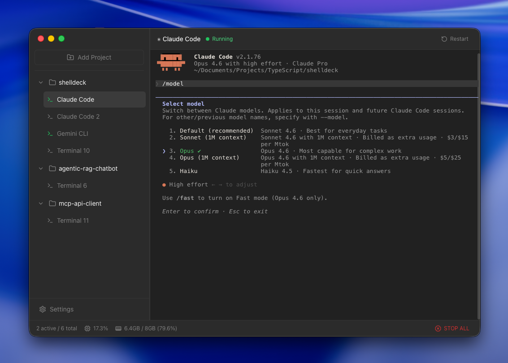

<h3 align="center">&nbsp;&nbsp;shelldeck</h3>

<p align="center">
  A lightweight multi-terminal dashboard for managing concurrent shell sessions by workspace.<br>
  Built for running multiple coding agents side by side.
</p>

<p align="center">
  <a href="https://github.com/etaaa/shelldeck/actions/workflows/ci.yml"></a>
  <a href="https://github.com/etaaa/shelldeck/blob/main/LICENSE"></a>
  <a href="https://github.com/etaaa/shelldeck/releases"></a>
</p>

---

<p align="center">
  
</p>

Running CLI-based coding agents (Claude Code, Codex, Gemini CLI, etc.) across multiple projects means juggling a lot of terminal windows. shelldeck gives you a single dashboard where each workspace gets its own group of terminals, all starting in the right directory. Switch between agents without losing output and restart crashed sessions in one click.

It works just as well for general terminal workflows, but the multi-agent use case is what motivated it.

## Features

- Group terminals by workspace: each opens in the right directory
- Run multiple coding agents (Claude Code, Codex, Gemini CLI) side by side
- Switch between terminals without losing output
- Keyboard shortcuts and in-terminal search
- Cross-platform (macOS, Linux, Windows)

## Download

| Platform | Link |
|----------|------|
| macOS (Apple Silicon) | [shelldeck_0.1.0_aarch64.dmg](https://github.com/etaaa/shelldeck/releases/latest/download/shelldeck_0.1.0_aarch64.dmg) |
| macOS (Intel) | [shelldeck_0.1.0_x64.dmg](https://github.com/etaaa/shelldeck/releases/latest/download/shelldeck_0.1.0_x64.dmg) |
| Windows | [shelldeck_0.1.0_x64-setup.exe](https://github.com/etaaa/shelldeck/releases/latest/download/shelldeck_0.1.0_x64-setup.exe) |
| Linux (Debian/Ubuntu) | [shelldeck_0.1.0_amd64.deb](https://github.com/etaaa/shelldeck/releases/latest/download/shelldeck_0.1.0_amd64.deb) |
| Linux (AppImage) | [shelldeck_0.1.0_amd64.AppImage](https://github.com/etaaa/shelldeck/releases/latest/download/shelldeck_0.1.0_amd64.AppImage) |

> **macOS users:** The app is not currently notarized with Apple, so macOS will block it from opening. After downloading, run this in your terminal to fix it:
> ```bash
> xattr -cr /Applications/shelldeck.app
> ```

## Building from source

Requires Node.js 20+ and Rust.

```bash
git clone https://github.com/etaaa/shelldeck.git
cd shelldeck
npm install
npm run dev
```

## Contributing

1. Fork the repo and create a feature branch.
2. Run `npm run lint` and `npm run format` before committing.
3. Open a pull request against `main`.

## License

[MIT](LICENSE). Use it however you want.
